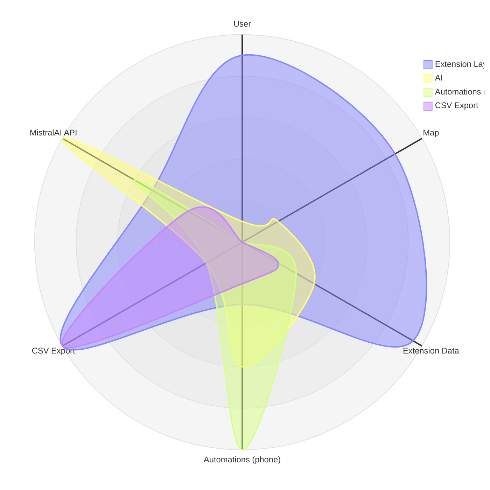

# Contact List Collector Browser Extension

## Usability of the project

If you want to extend this extension with more advanced AI capabilities, consider:

- **Usability & Local Examples:** Browser extensions like this can be developed and tested entirely on your local machine, making them easy to iterate and customize. You can build powerful tools for personal or business use—such as scraping, automation, or AI-powered workflows—without needing to deploy a server or cloud infrastructure. Example: Use this extension to collect leads, analyze business data, or automate messaging, all from your browser. If you are starting to code building extensions is a great opportunity to understand which automations makes web browsers powerful and useful for your work.
- **Real-Time Web Integration:** For up-to-date information, implement logic to fetch live content from business websites or Google Maps APIs, and pass that content to the AI model as additional context. This enables the AI to answer with the most current data, even if it was not present in its training set.
- **Function Calling:** Use an AI model that supports function calling (like OpenAI's GPT-4 with function calling or similar). This allows the AI to trigger specific actions in your code, such as fetching live website content, running calculations, or interacting with external APIs based on user queries.
- **SEO and LLM Search Optimization:** Make your website easy to find and understand for both search engines and AI models. Keep your site updated and increase site engagement and cross referencing, use accessible content, and get more reviews for ranking on Google Maps. Sites that are well-maintained show up higher in search results, helping more people find your business.

These enhancements can make your extension more powerful, but also require careful handling of API limits, privacy, and user experience.

---

## 1. Project Goal, Process, and Architecture

**Goal:**  
Contact List Collector is a Chrome extension that scrapes business contact data from Google Maps, allows users to ask AI-powered questions about the results, and sends summaries directly to Telegram. It is designed for professionals who need to collect, analyze, and share business leads efficiently.

**Process Overview:**
1. User navigates to a Google Maps search page.
2. The extension scrapes visible business data (name, phone, website, etc.).
3. User can ask a question about the businesses; the extension queries MistralAI for a summary.
4. The AI response is displayed and can be sent to a Telegram chat.
5. Results can be downloaded as CSV.

**Architecture:**



- **index.html**: UI for user interaction.
- **script.js**: Handles scraping, AI queries, Telegram integration, and CSV export.
- **manifest.json**: Chrome extension manifest and permissions.
- **/assets**: Icons and images.

---

## 2. File Structure

```
extensions/
├── 4281154.png           # Settings icon
├── 439328.png            # Ask/AI icon
├── index.html            # Main popup UI
├── manifest.json         # Chrome extension manifest
├── map.png               # Logo icon
├── maps.png              # Map hero image
├── script.js             # Main extension logic
```

---

## 3. How to Edit the Project

### Prerequisites
- Chrome browser
- Basic knowledge of JavaScript, HTML, and Chrome Extensions

### Setup & Editing

1. **Clone or Download the Repository**
   ```
   git clone <your-repo-url>
   cd extensions
   ```

2. **Edit Source Files**
   - `index.html`: Change the UI, add/remove fields, or update styles.
   - `script.js`: Update scraping logic, AI/Telegram integration, or add new features.
   - `manifest.json`: Change extension name, permissions, or icons.

3. **API Keys**
   If you want to use AI or Telegram features, you must provide your own API keys:
   - **MistralAI API Key:** Sign up at https://mistral.ai/ and generate an API key. Enter it in the extension settings.
   - **Telegram Bot Token:**
     1. Start a chat with [@BotFather](https://t.me/BotFather) on Telegram.
     2. Use the /newbot command to create a new bot and follow the instructions to get your token.
     3. Say 'Hello World' to your bot by searching for its username in Telegram and sending the /start command or any message to initiate the conversation.
     4. Enter the token in the extension settings.
   - **Telegram Chat ID:** Send a message to your bot, then visit `https://api.telegram.org/bot<YourBotToken>/getUpdates` to find your chat ID in the response.

   Never commit your API keys to a public repository.

4. **Load Unpacked Extension in Chrome**
   - Go to `chrome://extensions/`
   - Enable "Developer mode"
   - Click "Load unpacked" and select the `extensions` folder.

5. **Test and Debug**
   - Use the Chrome Extensions page and DevTools to debug popup and background scripts.

6. **Contributing**
   - Fork the repo, create a new branch, and submit pull requests for improvements.

---

## 4. AI Model Capabilities and Design Choices

### How the Extension Uses AI
- The extension sends scraped business data and user questions to an AI model (Mistral v3) via API.
- The AI model answers based only on the provided data and its training, not by browsing the web in real time.

### Why Use a Smaller Model Like Mistral v3?
- **Efficiency:** Smaller models like Mistral v3 are fast and cost-effective for focused tasks.
- **Contextual Reasoning:** When you provide structured data (like a table of businesses), Mistral v3 can efficiently "search" and reason over that data to answer specific queries, even without internet access.
- **Control:** You decide exactly what data the model uses, making answers more predictable and secure. This reduces hallucination and ensures responses are based only on your provided, up-to-date data.
- **Comparison:** Larger models (like GPT-4 or Grok 4) may have more general knowledge or web browsing, but for tasks where you want answers strictly from your provided data, a smaller model is often more reliable and less expensive. Large models may reference information from public websites if those sites were included in their training data, which is most likely for popular or well-crawled sites within the last 2 years before the model's training cut-off. However, this is not guaranteed for all sites or for the most recent content.
- **Real-Time Web Lookup vs. Provided Data**
- **LLM Models:** Some advanced models (like Grok 4) can browse the web in real time and use live data to answer questions. It is not currently supported in this extension. For Google Maps data extraction, real-time web browsing is not needed because all relevant business information (name, phone, website, address, etc.) is already available in the page's DOM and can be scraped directly. This makes the process faster, more reliable, and less dependent on external web content.

### Relation to Function Calling
- **Function Calling (in LLMs):** Some AI models can trigger specific functions in your code (e.g., fetch a website, run a calculation) based on user intent. This is called "function calling."
- **This Extension's Approach:** Instead of letting the AI trigger code, this solution gives the model all the structured business data it needs up front. The model then "acts" as if it is searching or filtering, but does so entirely within its own reasoning, based on the data you provide. This approach is similar to function calling in that the model is guided to answer using only the provided data, but it is simpler, more secure, and fully under your control.

---

## Notes

- All API keys and tokens are handled client-side; never commit secrets to the repository.

---

